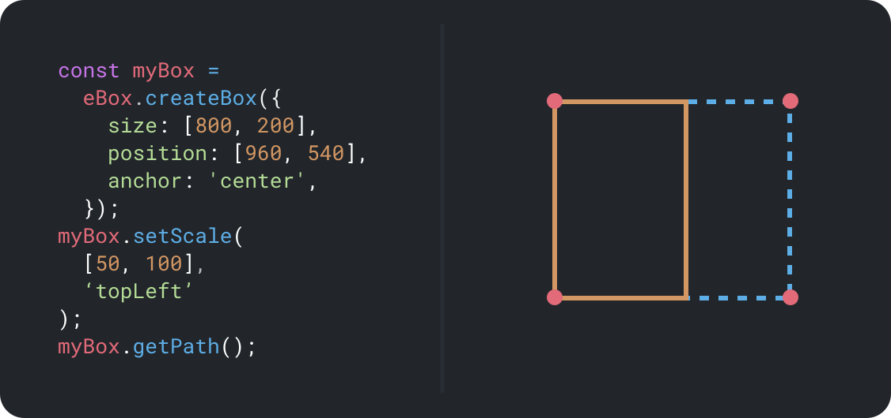

[back to top ↑]: #ebox-

<div align="center">

# eBox 🏗<!-- omit in toc -->

Create rectangles within After Effects expressions



---

### [✨ Download eBox ✨](https://github.com/motiondeveloper/eBox/releases)<!-- omit in toc -->

---

</div>

## Overview

eBox a system for creating rectangles in After Effects with intuitive controls for changing their position, size, and scale.

It comes in the form of a JSON file that's imported into the project, and a set of expressions you apply to a path property, with the box parameters edited within the expression.

The benefit of using eBox is being able to easily create and scale boxes in expressions, while maintaining a consistent anchor point.

You can animate each of the box properties with the expression animation tool, **[`eKeys 🔑`](https://github.com/motiondeveloper/ekeys)**.

> **eBox is written in TypeScript using our [Expression Library Template](https://github.com/motiondeveloper/expressions-library-template)**

## Contents <!-- omit in toc -->

- [Overview](#overview)
- [Example](#example)
- [Usage](#usage)
- [License](#license)
- [Contact](#contact)

## Example

An example setup of an eBox setup:

```javascript
// Import eBox library
const eBox = footage('eBox.jsx').sourceData;

// Create new eBox
const myBox = eBox.createBox({
  size: [800, 200],
  position: [960, 540],
  rounding: [12, 12, 12, 12],
  anchor: 'center',
});

// Scale the box in from the left
myBox.setScale([scaleIn, 100], 'centerLeft');

// Scale the box off from the right
myBox.setScale([scaleOut, 100], 'centerRight');

// Return the box path
myBox.getPath();
```

[Back To Top ↑]

## Usage

1. **Download and import [`eBox.jsx`](https://github.com/motiondeveloper/eBox/releases) into your After Effects project**

   This is the JSON file that contains the necesary code to run eBox. You may not be able to drag and drop it into your project, in which case you will need to use the import dialog.

   **Note:** eBox is only compatable with After Effects versions >= 15.1.

2. **Add a refrence to the library in your expression**

   To refrence the library in an expression, you need to assign it to a variable. This is done via the line:

   ```javascript
   const eBox = footage('eBox.jsx').sourceData;
   ```

   > ⚠️ Since After Effects doesn't count footage items that are only referenced within expressions as used, it's recommended that you also place the `eBox.jsx` file in any compositions where it is referenced.
   >
   > This will ensure After Effects includes the file when collecting assets or packaging into a Motion Graphics Template.

3. **Create an eBox**

   You then call the `.createBox()` function, passing it an object containing the properties for box.

   ```javascript
   const myBox = eBox.createBox({
     size: [800, 200],
     position: [960, 540],
     anchor: 'topLeft',
     isClosed: true,
   });
   ```

   <details><summary><strong>Box Object Properties</strong></summary>
   <br>

   - **`size`:** The size of the box, in pixels
     - Type: `array`
     - Required: `true`
     - **`position`:** The position of the box in the composition
     - Type: `array`
     - Required: `true`
   - **`anchor`:** The anchor point that will be at the given `position`
     - Type: `string`
     - Options: `topLeft, topCenter, topRight, bottomLeft, bottomCenter, bottomRight, centerLeft, center, centerRight`
     - Required: `true`
   - **`isClosed`:** Whether the path is closed
     - Type: `boolean`
     - Required: `false`
     - Default: `true`
   - **`rounding`:** Radius for each corner
     - Type: `array`
     - Required : `false`
       </details>
       <br>

4. **Set the scale**

   > This step is optional, you can call `myBox.getPath()` without applying any scaling

   Scale the box, from the center or a corner:

   ```javascript
   myBox.setScale(scale, anchorPoint);
   ```

   <details><summary><strong>Set Scale Parameters</strong></summary>
   <br>

   - **`scale`:** Scale of the box
     - Type: `array`
     - Range: `[0..100, 0..100]`
     - Required: `true`
   - **`anchor`:** The anchor point that will be at the given `position`
     - Type: `string`
     - Options: `topLeft, topCenter, topRight, bottomLeft, bottomCenter, bottomRight, centerLeft, center, centerRight`
     - Required: `true`
       </details>
       <br>

5. **Show the box**

   This function returns the path for the box:

   ```javascript
   eBoxName.getPath();
   ```

[Back To Top ↑]

## License

This project is licensed under the terms of the MIT license.

[Back To Top ↑]

## Contact

Bugs, issues and feature requests can be submitted by filing an [issue](https://github.com/motiondeveloper/ekeys/issues) on Github. For everything else, feel free to reach out to [@modeveloper](https://twitter.com/modeveloper) on twitter.

[Back To Top ↑]
